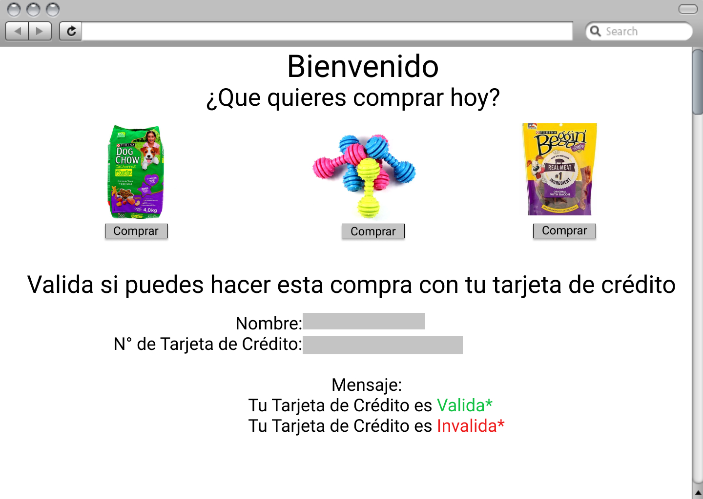
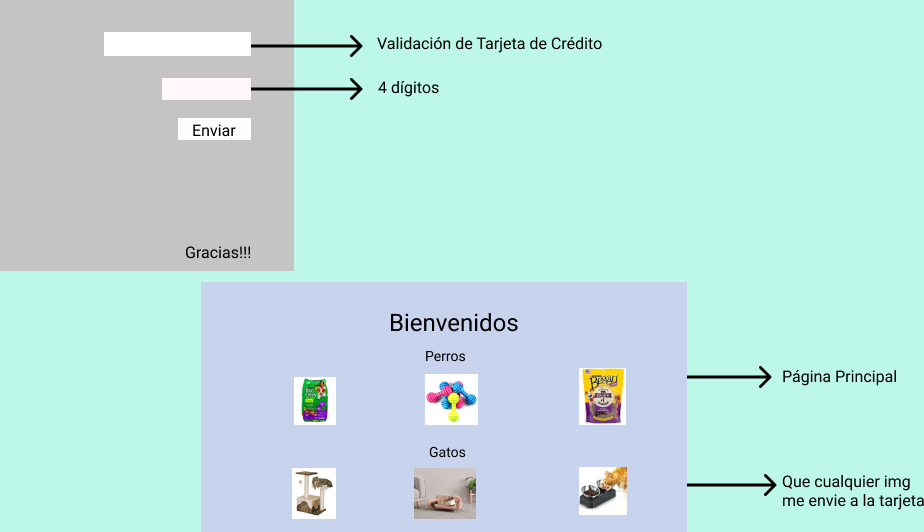
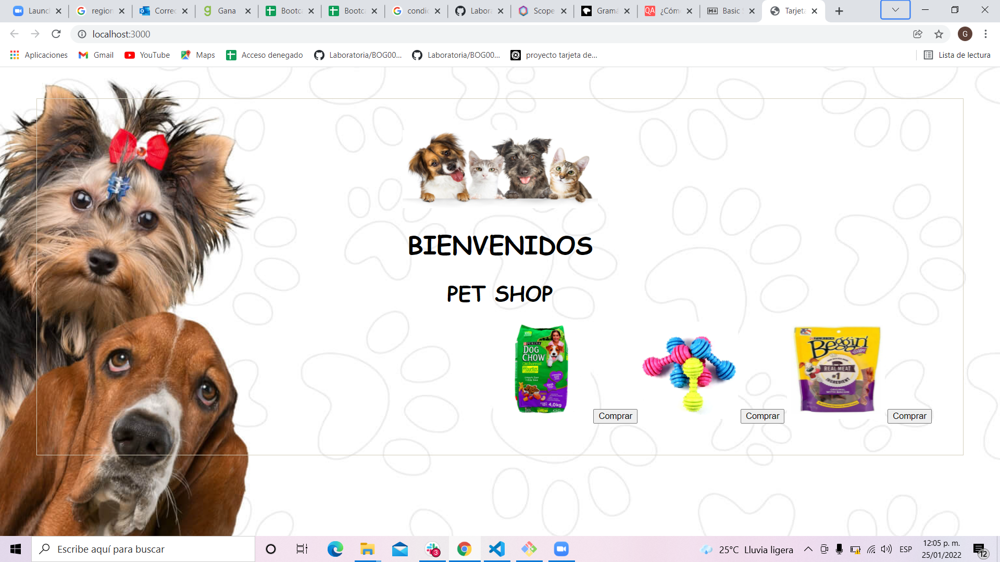
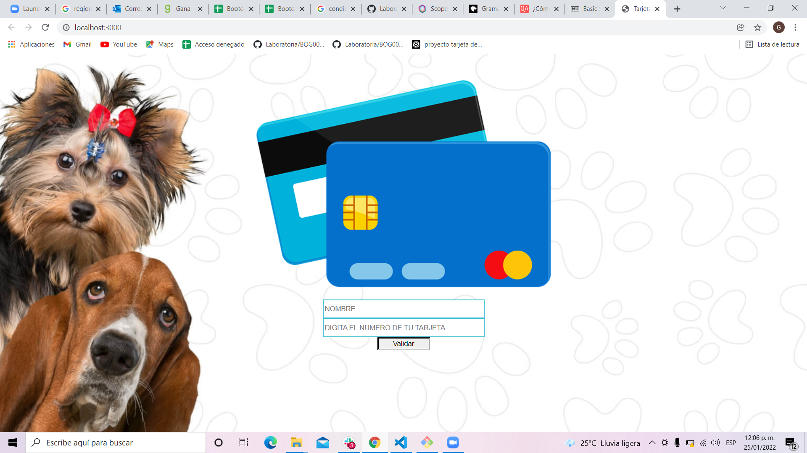
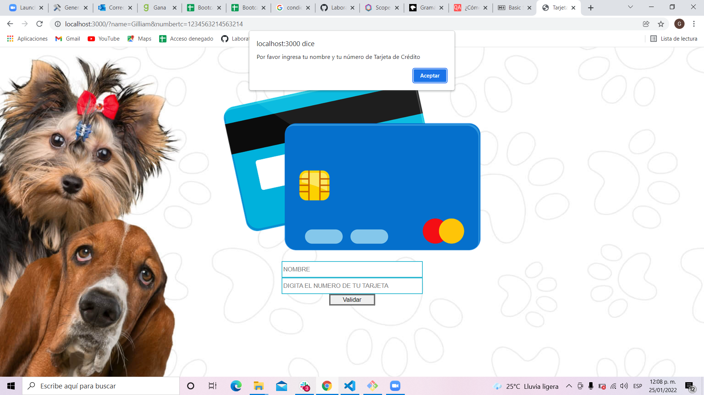

# PET SHOP
## 2. Resumen del proyecto
 
En este proyecto construimos una pagina web donde debiamos hacer la validacion de una tarjeta de credito, ocultando los numeros a excpecion de los ultimos 4 utilizando en esta parte el algoritmo de luhn y metodos como el isValid y el maskify.

La temática fue una tienda de perritos asi que nos basamos en los usuarios que tienen mascota y pensando siempre en los productos mas buscados e indispensables en este caso como la comida, juguetes y premios, buscamos siempre que fuese una pagina dinamica, practica y facil al momento del usuario utilizar y querer hacer su compra.

trabajamos en pareja y en conjunto diseñamos esta pagina web, utilizando los prototipos y las ideas que se fueron tomando desde un principio. Aplicandolas en Java script, css y en este caso el validator.

Estos fueron nuestros prototipos para el diseño de la pagina web: 
 
 

 

 y asi nos quedo la pagina ya terminada

